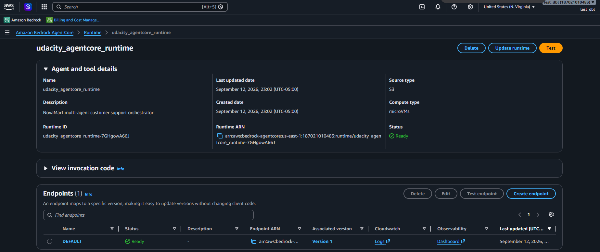
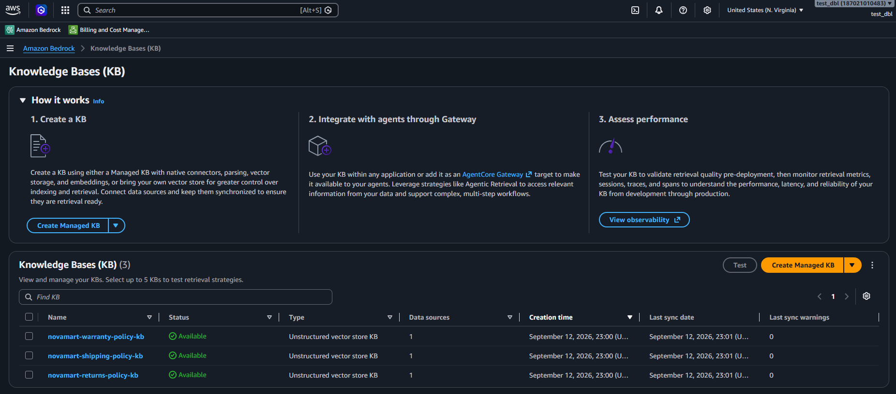
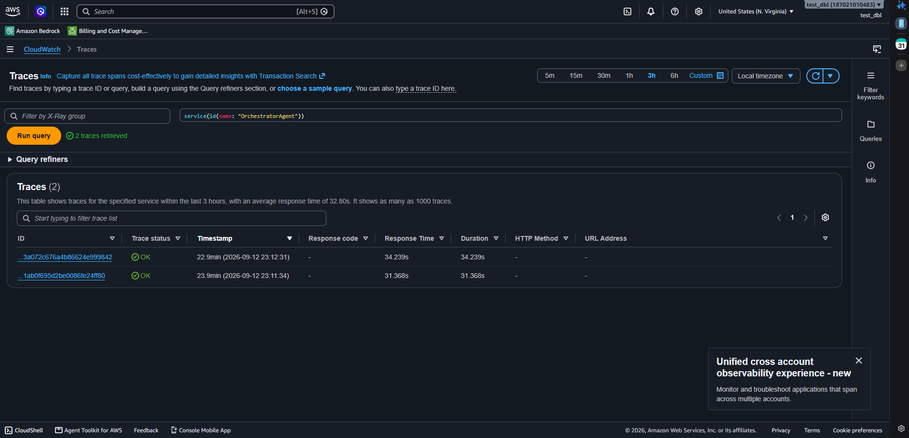
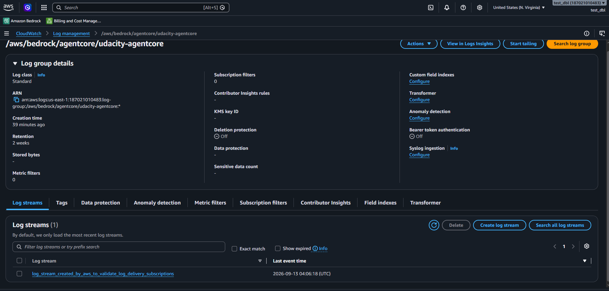

# Evidence directory

This folder holds everything collected while building and verifying NovaMart's multi-agent system. It's organized to follow the rubric's own section order — `Multi-Agent Graph → AgentCore Runtime and Guardrails → Memory and Knowledge Bases → Observability → Industry Best Practices` — so you can work through it in the same sequence as the rubric itself.

If anything about Task 6 (Observability) looks unusual, read [`TASK6-OBSERVABILITY-BUG.md`](TASK6-OBSERVABILITY-BUG.md) — it walks through what happened there and what was built instead.

## The one required deliverable

[`required/`](required/) contains the single screenshot the project instructions and rubric ask for — a connected X-Ray Service Map from a live run of the deployed system, `OrchestratorAgent` reaching `InventoryAgent`, `RefundAgent`, and `CommunicationAgent`. See [`required/README.md`](required/README.md) for exactly what it shows, how it was produced, and where the raw trace data lives. It belongs under the rubric's **Observability** section, below.

## Everything else, in rubric order

Nothing in [`additional-info/`](additional-info/) is required by the rubric — it's an honest record of how each task was built and verified, kept for context rather than as separate submission artifacts.

**Before the rubric sections — environment setup:** [`additional-info/00-setup/`](additional-info/00-setup/) covers identity, the deployed CloudFormation stack, and seeded data — the groundwork every task after it depends on.

### Multi-Agent Graph

[`additional-info/02-agents/`](additional-info/02-agents/) — the worker-agent implementation (Inventory, Refund, Policy's parallel retrievers, Orchestrator), its test score, an implementation diff, and a real end-to-end refund-chain trace showing the routing rules in action.

### AgentCore Runtime and Guardrails

[`additional-info/03-guardrail-runtime/`](additional-info/03-guardrail-runtime/) — the Guardrail's policy configuration, the deployed Runtime's detail, and the Task 3 test score.

The deployed runtime (`udacity_agentcore_runtime-7GHgowA66J`), matching the ARN in `.env`.

### Memory and Knowledge Bases

[`additional-info/04-memory/`](additional-info/04-memory/) — AgentCore Memory configuration and its test score, and [`additional-info/05-kb/`](additional-info/05-kb/) — the three Knowledge Bases' sync history, a real parallel-retrieval query with grounded content from all three, and the Task 5 test score.

All three KBs (returns, shipping, warranty), synced and `Available`.

### Observability

[`additional-info/06-observability/`](additional-info/06-observability/) — the Task 6 test result and deploy-time observability step output, discussed fully in [`TASK6-OBSERVABILITY-BUG.md`](TASK6-OBSERVABILITY-BUG.md).

The two real traces behind the required Service Map, with their actual durations.

AWS's own confirmation that the CloudWatch Logs Delivery pipeline built as the real alternative for Task 6 is genuinely live, not just configured.

### Industry Best Practices

Docstrings, naming, and model selection are properties of the code itself (`project/starter/src/agent_orchestrator.py`) rather than something to screenshot — see [`additional-info/07-e2e/`](additional-info/07-e2e/) for the final version of that file alongside the final full test run and a redacted `.env`, captured once every other section above was complete.

## One thing worth knowing about the older snapshots

Most of the `.txt`/`.diff` files above were captured against this project's *first* deployment. That deployment was torn down and redeployed once, midway through the project, to avoid leaving AWS resources running during a pause — so a handful of resource IDs/ARNs in the older snapshots won't match what's in `.env` today, even though they still accurately show each task passing at the time. The X-Ray evidence above and its underlying trace JSON in `additional-info/07-e2e/E7.3-xray-service-graph-CONNECTED.json` were both regenerated against the current deployment, so those do match `.env` as-is.
