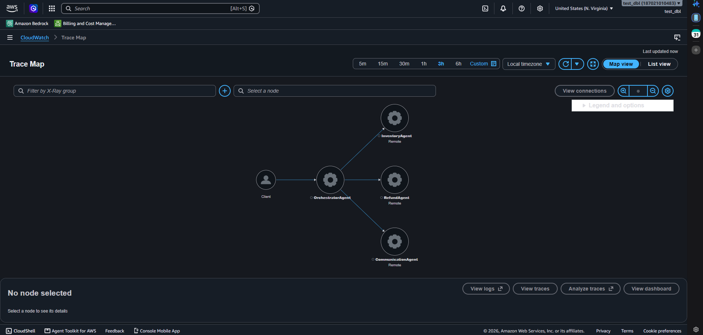

# Evidence directory

This folder holds everything collected while building and verifying NovaMart's multi-agent system, split into two parts so anyone can find what actually matters without digging through internal notes.

If anything about Task 6 (Observability) looks unusual, read [`TASK6-OBSERVABILITY-BUG.md`](TASK6-OBSERVABILITY-BUG.md) — it walks through what happened there and what was built instead.

## `required/` — the one thing the rubric asks for

A connected X-Ray Service Map from a live run of the deployed system — `OrchestratorAgent` reaching `InventoryAgent`, `RefundAgent`, and `CommunicationAgent`. This is the single screenshot the project instructions and rubric ask for. See [`required/README.md`](required/README.md) for exactly what it shows, how it was produced, and where the raw trace data lives.

## `additional-info/` — everything collected along the way

Test-run snapshots, deploy logs, score records, an implementation diff, and a handful of supplementary console screenshots — none of it required by the rubric, all of it kept as an honest record of how each task was built and verified. A few of the more visual pieces:

| Screenshot | What it shows |
|---|---|
| [Knowledge Bases, all Available](additional-info/screenshots/bedrock-knowledge-bases-list.png) | The three Bedrock Knowledge Bases (returns, shipping, warranty), synced and ready. |
| [X-Ray traces list](additional-info/screenshots/xray-traces-list-orchestratoragent.png) | The two real OrchestratorAgent traces behind the required Service Map, with their actual durations. |
| [CloudWatch log delivery, validated](additional-info/screenshots/cloudwatch-log-group-delivery-validation-stream.png) | AWS's own confirmation that the CloudWatch Logs Delivery pipeline built for Task 6 is genuinely live, not just configured. |
| [AgentCore Runtime detail](additional-info/screenshots/agentcore-runtime-detail-overview.png) | The deployed runtime, `Ready` and matching the ARN in `.env`. |

The rest — `00-setup/` through `07-e2e/` — are text snapshots (test scores, deploy output, an implementation diff) from each phase of the build, organized by task.

**One thing worth knowing if you dig into the `.txt`/`.diff` files:** most of them were captured against this project's *first* deployment. That deployment was torn down and redeployed once, midway through the project, to avoid leaving AWS resources running during a pause — so a handful of resource IDs/ARNs in the older snapshots won't match what's in `.env` today, even though they still accurately show each task passing at the time. The X-Ray evidence above and the trace JSON in `07-e2e/` were both regenerated against the current deployment, so those do match `.env` as-is.
